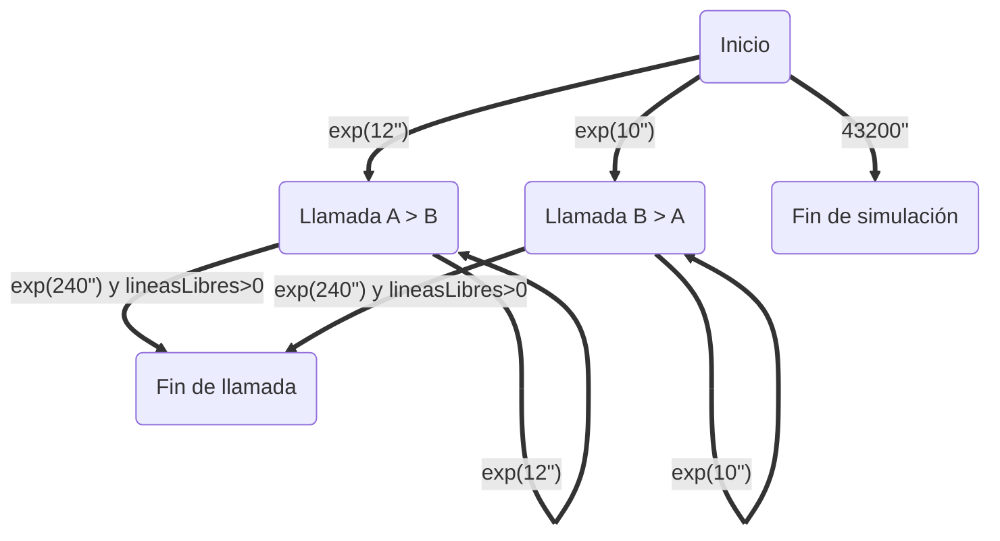

# Grafo de sucesos

```mermaid
flowchart TD
    A(Inicio) ==> |"exp(12#quot;)"| B(Llamada A > B)
    A(Inicio) ==> |"exp(10#quot;)"| C(Llamada B > A)
    A(Inicio) ==> |"43200#quot;"|D(Fin de simulación)
    B ==>|"exp(12#quot;)"|B
    C ==>|"exp(10#quot;)"|C
    B ==>|"exp(240#quot;) y lineasLibres>0"|E(Fin de llamada)
    C ==> |"exp(240#quot;) y lineasLibres>0"|E
```
